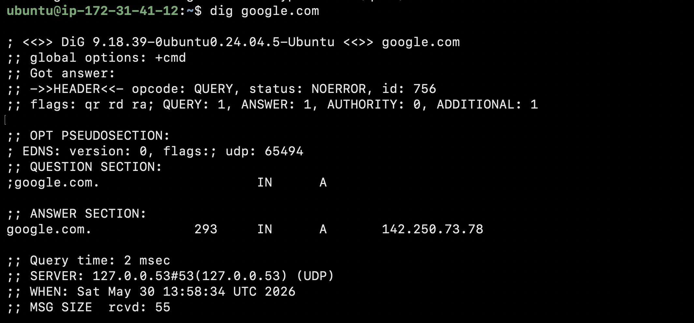
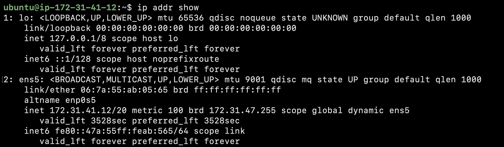
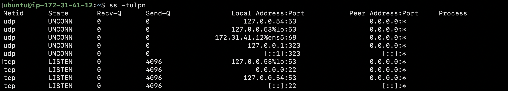

# Day 15 - Networking Concepts: DNS, IP, Subnets & Ports

## Introduction

Today I explored the core networking concepts every DevOps engineer should understand. I learned how domain names are translated into IP addresses, how IPv4 addressing works, the basics of CIDR and subnetting, and how ports allow services to communicate across networks.

---

## Task 1 - DNS: How Names Become IPs

### What Happens When You Type google.com in a Browser?

1. The browser sends a DNS query to resolve the domain name.
2. DNS servers return the IP address associated with the domain.
3. The browser establishes a connection to that IP address.
4. The web server responds with the requested webpage.

### Common DNS Record Types

| Record | Purpose                                   |
| ------ | ----------------------------------------- |
| A      | Maps a domain name to an IPv4 address     |
| AAAA   | Maps a domain name to an IPv6 address     |
| CNAME  | Creates an alias for another domain       |
| MX     | Specifies mail servers for email delivery |
| NS     | Identifies authoritative name servers     |

### DNS Lookup Command

```bash
dig google.com
```

### Command Output

```bash
;; ANSWER SECTION:
google.com.		293	IN	A	142.250.73.78

```

### Screenshot



---

## Task 2 - IP Addressing

### What is an IPv4 Address?

An IPv4 address is a 32-bit numerical identifier assigned to devices on a network. It consists of four octets separated by dots, such as 192.168.1.10.

### Public vs Private IP Addresses

| Type       | Example      |
| ---------- | ------------ |
| Public IP  | 8.8.8.8      |
| Private IP | 192.168.1.10 |

### Private IP Ranges

* 10.0.0.0/8
* 172.16.0.0 – 172.31.255.255
* 192.168.0.0/16

### My System IP

```text
172.31.41.12/20
```

This address belongs to the private IP range 172.16.0.0 – 172.31.255.255.

### Command Used

```bash
ip addr show
```

### Screenshot



---

## Task 3 - CIDR & Subnetting

### What Does /24 Mean?

The first 24 bits represent the network portion of the address, while the remaining 8 bits are used for host addresses.

### Why Do We Subnet?

* Better network organization
* Improved security
* Efficient IP allocation
* Reduced broadcast traffic

### CIDR Table

| CIDR | Subnet Mask     | Total IPs | Usable Hosts |
| ---- | --------------- | --------- | ------------ |
| /24  | 255.255.255.0   | 256       | 254          |
| /16  | 255.255.0.0     | 65,536    | 65,534       |
| /28  | 255.255.255.240 | 16        | 14           |

---

## Task 4 - Ports: The Doors to Services

### What is a Port?

A port is a logical communication endpoint that allows multiple services to run on the same device while keeping network traffic organized.

### Common Ports

| Port  | Service |
| ----- | ------- |
| 22    | SSH     |
| 80    | HTTP    |
| 443   | HTTPS   |
| 53    | DNS     |
| 3306  | MySQL   |
| 6379  | Redis   |
| 27017 | MongoDB |

### Command Used

```bash
ss -tulpn
```

### Command Output

```bash
ubuntu@ip-172-31-41-12:~$ ss -tulpn
Netid      State       Recv-Q      Send-Q               Local Address:Port           Peer Address:Port     Process      
udp        UNCONN      0           0                       127.0.0.54:53                  0.0.0.0:*                     
udp        UNCONN      0           0                    127.0.0.53%lo:53                  0.0.0.0:*                     
udp        UNCONN      0           0                172.31.41.12%ens5:68                  0.0.0.0:*                     
udp        UNCONN      0           0                        127.0.0.1:323                 0.0.0.0:*                     
udp        UNCONN      0           0                            [::1]:323                    [::]:*                     
tcp        LISTEN      0           4096                 127.0.0.53%lo:53                  0.0.0.0:*                     
tcp        LISTEN      0           4096                       0.0.0.0:22                  0.0.0.0:*                     
tcp        LISTEN      0           4096                    127.0.0.54:53                  0.0.0.0:*                     
tcp        LISTEN      0           4096                          [::]:22                     [::]:*                     
ubuntu@ip-172-31-41-12:~$ git google.com

```

### Screenshot



---

## Task 5 - Putting It Together

### What Happens When Running curl http://myapp.com:8080 ?

* DNS resolves myapp.com into an IP address.
* The system establishes a TCP connection to port 8080.
* Packets are routed through the network using IP addressing.
* The application responds with the requested data.

### Your App Cannot Reach Database at 10.0.1.50:3306. What Would You Check?

* Verify database service is running.
* Check network connectivity.
* Confirm MySQL is listening on port 3306.
* Review firewall and security group rules.
* Validate application configuration.

---

## Key Learnings

* DNS converts human-readable domain names into IP addresses.
* CIDR notation helps efficiently manage and divide networks.
* Ports allow multiple services to communicate over a single IP address.
* Understanding networking fundamentals is essential for troubleshooting in DevOps environments.
