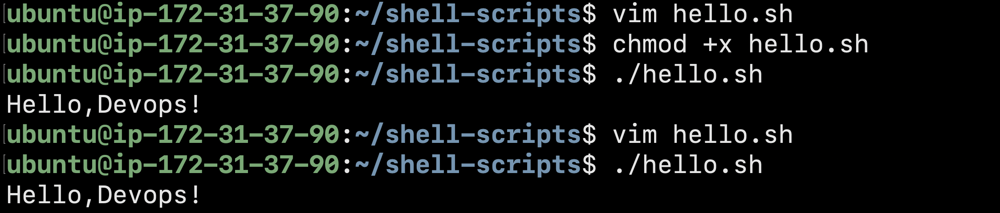
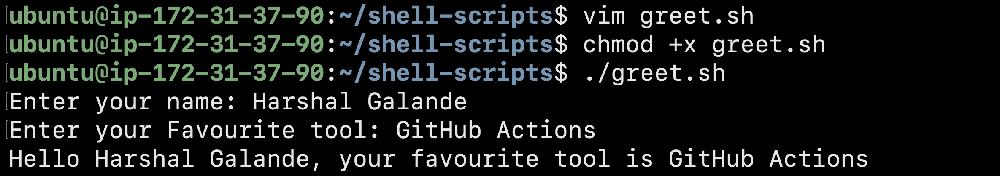
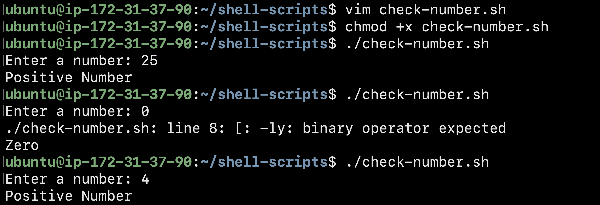
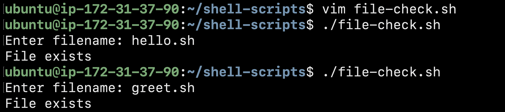
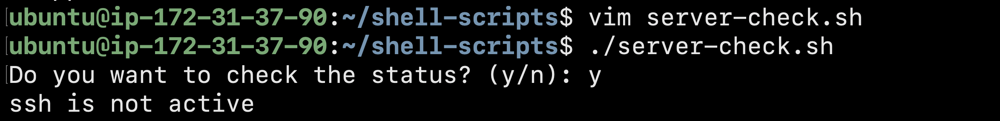

# Day 16 - Shell Scripting Basics

## Introduction

Today I started learning Shell Scripting, one of the core skills required for Linux administration and DevOps automation. Shell scripts allow us to automate repetitive tasks, interact with users, and make decisions based on conditions.

---

## Task 1: Your First Script

### Script: `hello.sh`

```bash
#!/bin/bash

echo "Hello, DevOps!"
```

### Execution

```bash
chmod +x hello.sh
./hello.sh
```

### Output

```text
Hello, DevOps!
```


### What Happens Without a Shebang?

The shebang (`#!/bin/bash`) tells Linux which interpreter should execute the script.

Without the shebang:

* Running the script with `bash hello.sh` still works.
* Running the script directly using `./hello.sh` may fail or use a different shell depending on the system configuration.
* The script becomes less portable and predictable.

---

## Task 2: Variables

### Script: `variables.sh`

```bash
#!/bin/bash

NAME="Harshal"
ROLE="DevOps Engineer"

echo "Hello, I am $NAME and I am a $ROLE"
```

### Execution

```bash
chmod +x variables.sh
./variables.sh
```

### Output

```text
Hello, I am Harshal and I am a DevOps Engineer
```

### Single Quotes vs Double Quotes

```bash
NAME="Harshal"

echo '$NAME'
echo "$NAME"
```

### Output

```text
$NAME
Harshal
```

### Observation

* Single quotes (`' '`) treat variables as plain text.
* Double quotes (`" "`) expand variables and display their values.

---

## Task 3: User Input with read

### Script: `greet.sh`

```bash
#!/bin/bash

read -p "Enter your name: " NAME
read -p "Enter your favourite tool: " TOOL

echo "Hello $NAME, your favourite tool is $TOOL"
```

### Execution

```bash
chmod +x greet.sh
./greet.sh
```

### Sample Output

```text
Enter your name: Harshal
Enter your favourite tool: Docker

Hello Harshal, your favourite tool is Docker
```


---

## Task 4A: If-Else Conditions

### Script: `check_number.sh`

```bash
#!/bin/bash

read -p "Enter a number: " NUM

if [ "$NUM" -gt 0 ]; then
    echo "Positive Number"
elif [ "$NUM" -lt 0 ]; then
    echo "Negative Number"
else
    echo "Zero"
fi
```

### Sample Output

```text
Enter a number: 10
Positive Number
```

---

## Task 4B: File Existence Check

### Script: `file_check.sh`

```bash
#!/bin/bash

read -p "Enter filename: " FILE

if [ -f "$FILE" ]; then
    echo "File exists"
else
    echo "File does not exist"
fi
```

### Sample Output

```text
Enter filename: hello.sh
File exists
```

---

## Task 5: Server Status Check

### Script: `server_check.sh`

```bash
#!/bin/bash

SERVICE="ssh"

read -p "Do you want to check the status? (y/n): " CHOICE

if [ "$CHOICE" = "y" ]; then

    if systemctl is-active --quiet $SERVICE; then
        echo "$SERVICE is active"
    else
        echo "$SERVICE is not active"
    fi

else
    echo "Skipped."
fi
```

### Sample Output

```text
Do you want to check the status? (y/n): y

ssh is inactive
```

---

## Key Learnings

* The shebang line specifies which interpreter executes a script.
* Variables help store and reuse data throughout a script.
* The `read` command allows user interaction through terminal input.
* Conditional statements (`if`, `elif`, `else`) enable decision-making in scripts.
* File checks and service status checks are common tasks in Linux administration and DevOps automation.

---

## Conclusion

This assignment introduced the fundamentals of Shell Scripting, including script execution, variables, user input, and conditional logic. These concepts form the foundation for creating automation scripts that simplify system administration and DevOps workflows.
