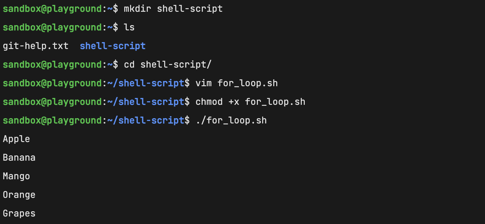
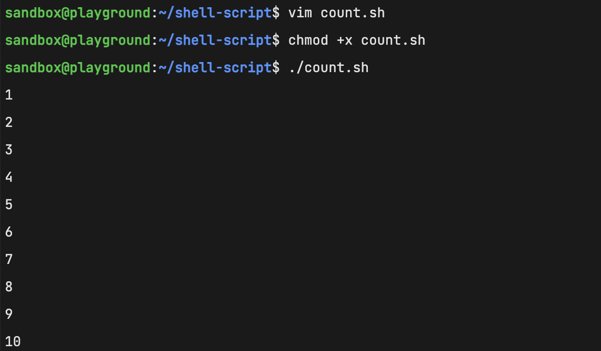
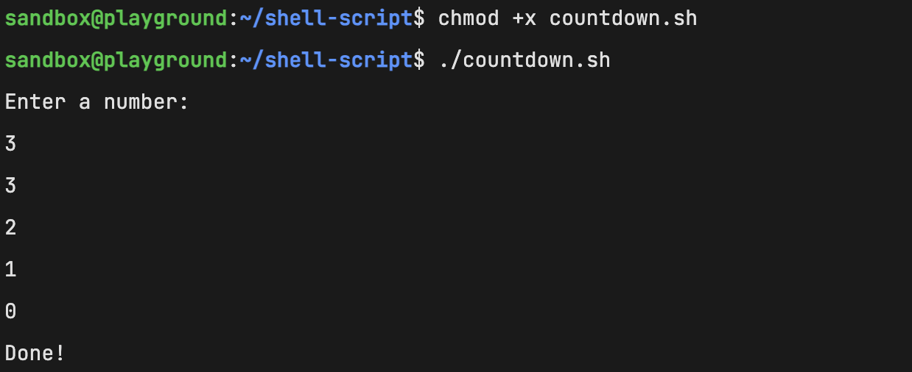
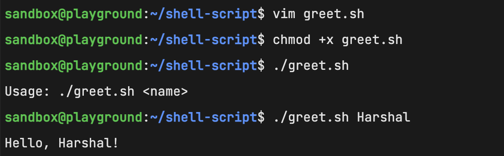
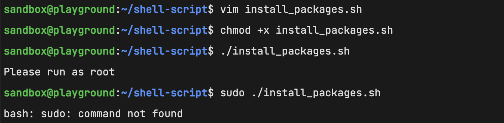
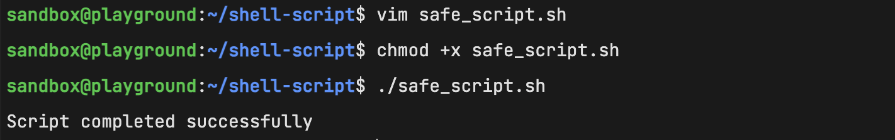

# Day 17 - Shell Scripting: Loops, Arguments & Error Handling

## Introduction

Today I learned how to use loops, command-line arguments, package installation automation, and error handling in Shell Scripting. These concepts help automate repetitive tasks and make scripts more reliable.

---

## Task 1 - For Loop

### for_loop.sh

Loops through a list of 5 fruits and prints each one.

**Snapshot:**

### count.sh

Prints numbers 1 to 10 using a for loop.

**Snapshot:**

---

## Task 2 - While Loop

### countdown.sh

Takes a number from the user, counts down to 0, and prints "Done!" when finished.

**Snapshot:**

---

## Task 3 - Command-Line Arguments

### greet.sh

Accepts a name as a command-line argument and prints a greeting message. If no argument is provided, it displays usage instructions.

**Snapshot:**

### args_demo.sh

Displays:

* Script name using `$0`
* Total number of arguments using `$#`
* All arguments using `$@`

**Snapshot:**
(Add screenshot here)

---

## Task 4 - Install Packages via Script

### install_packages.sh

Created a script that:

* Defines a list of packages (`nginx`, `curl`, `wget`)
* Checks whether each package is installed
* Installs missing packages
* Skips already installed packages
* Displays status messages

**Snapshot:**

---

## Task 5 - Error Handling

### safe_script.sh

Implemented error handling using:

* `set -e`
* `||` operator for handling failures
* Directory creation
* Navigation into the directory
* File creation

**Snapshot:**

---

## Root User Validation

### modified_install_packages.sh

Enhanced the package installation script to:

* Verify the script is executed as root
* Exit with an appropriate message if not run with sufficient privileges

**Snapshot:**

---

## What I Learned

* Using `for` and `while` loops to automate repetitive tasks.
* Working with command-line arguments using `$1`, `$#`, `$@`, and `$0`.
* Implementing basic error handling and root user validation in shell scripts.

---

## Conclusion

Day 17 helped me understand how shell scripts can automate system administration tasks efficiently. I practiced loops, user input handling, package management, command-line arguments, and error handling to build more practical and reliable scripts.
