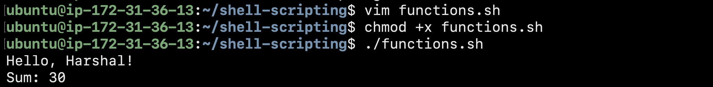
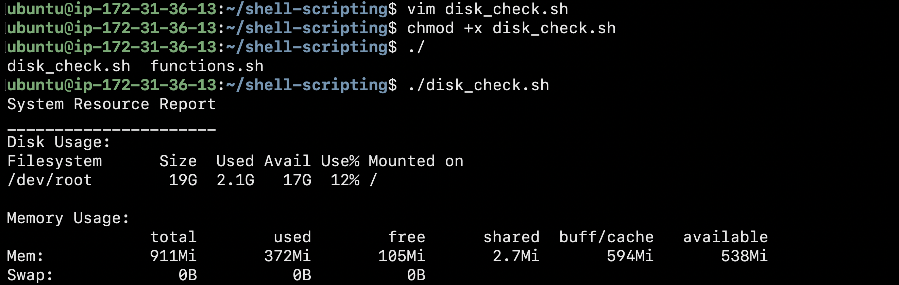
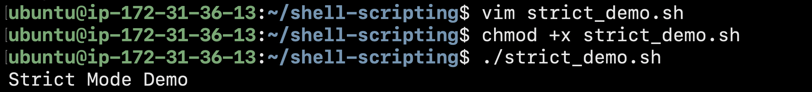
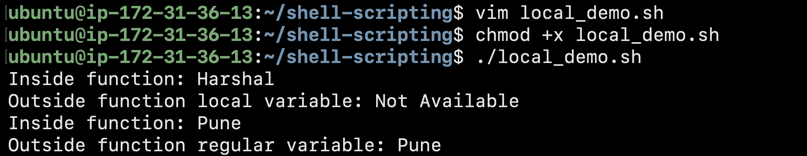
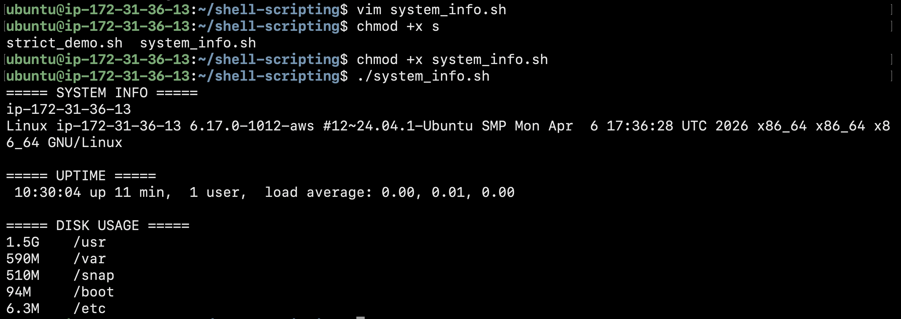

# Day 18 - Shell Scripting Functions & Intermediate Concepts

## Task 1 - Basic Functions

Learned how to create and call functions.

### Functions Used
- greet()
- add()

### Output

Hello, Harshal!
Sum: 30

---

## Task 2 - Disk & Memory Check

Created reusable functions:

- check_disk()
- check_memory()

Used:
- df -h
- free -h

---

## Task 3 - Strict Mode

Used:

set -euo pipefail

### Meaning

- set -e → Exit on command failure
- set -u → Exit on undefined variables
- set -o pipefail → Detect failures inside pipelines

Benefits:
- Safer scripts
- Easier debugging
- Prevents hidden errors

---

## Task 4 - Local Variables

Used local keyword inside functions.

Observed:
- Local variables stay inside functions
- Regular variables remain accessible outside

---

## Task 5 - System Info Reporter

Built a complete script using functions.

Features:
- Hostname and OS details
- Uptime information
- Disk usage
- Memory usage
- Top CPU-consuming processes

---

## Key Learnings

1. Functions make scripts reusable and cleaner.
2. local variables prevent accidental conflicts.
3. set -euo pipefail makes scripts safer and production-ready.