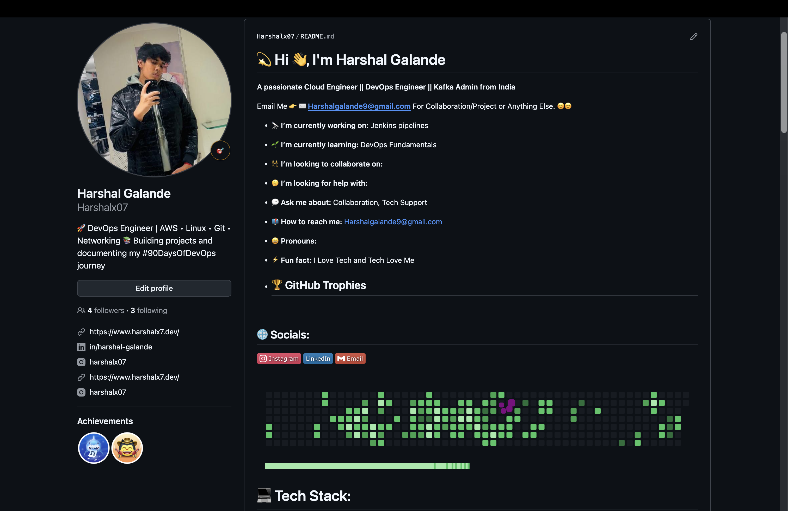
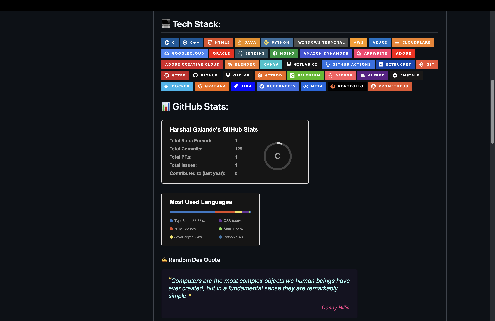

# Day 27 – GitHub Profile Makeover: Build Your Developer Identity

## Task 1: Audit Your Current GitHub Profile

Before making changes, assess where you stand.

Visit your own GitHub profile as if you were a stranger. What impression does it give?

### Answers

* Is your profile picture professional? - Yes
* Is your bio filled in? Does it say what you do? - Yes
* Are your pinned repos relevant, or are they random forks? - Relevant
* Do your repos have descriptions, or are they blank? - They have descriptions
* Would a recruiter understand what you've been working on? - Yes

## Task 2: Create Your Profile README

Created GitHub Profile README.

## Task 3: Organize Your Repositories

### 90 Days of DevOps

Created and organized the 90 Days of DevOps repository.

### Shell Scripts

Created a dedicated Shell Scripts repository for shell scripting projects and automation scripts.

### Python Scripts

Created a dedicated Python Scripts repository for Python projects and practice work.

### DevOps Notes

Created a DevOps Notes repository for learning notes, cheat sheets, and references.

## Task 4: Pin Your Best Repos

Pinned the most relevant repositories to showcase my work and learning journey.

## Task 5: Clean Up

* Reviewed repository names and descriptions.
* Verified repositories contain proper README files.
* Checked repositories for sensitive information.
* Removed or archived unnecessary repositories.

## Task 6:After

## What I Improved

1. Added a professional GitHub Profile README.
2. Organized repositories with proper structure and documentation.
3. Improved profile presentation by pinning relevant projects and cleaning up repositories.
